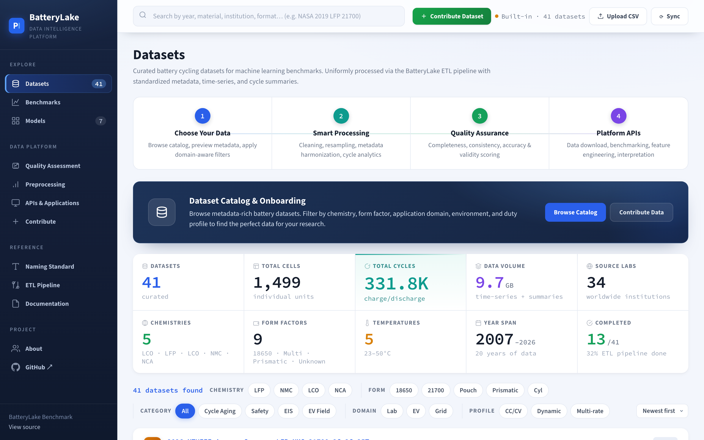

<div align="center">

# 🔋 BatteryLake Benchmark

### A Unified, Standardized Benchmark for Lithium-Ion Battery Prognostics & Health Management

**Curating the world's fragmented battery cycling data into one machine-learning-ready foundation.**

[](#-whats-inside)
[](#-whats-inside)
[](#-whats-inside)
[](#-whats-inside)
[](#-whats-inside)

[Explore the Platform](https://tianwen1209.github.io/BatteryLake-Benchmark-DataPrep/) · [Naming Standard](#-naming-standard) · [ETL Pipeline](#-the-etl-pipeline) · [Benchmark Tasks](#-benchmark-tasks)

<br/>



</div>

---

## 💡 Why BatteryLake?

Battery degradation research is held back by a **data fragmentation crisis**. Every lab releases its cycling data in its own format, with its own column names, units, sampling rates, and conventions — scattered across Zenodo, Figshare, Mendeley, OSF, institutional servers, and supplementary files. Before anyone can train a single model, weeks are lost to downloading, decoding, cleaning, and reconciling incompatible files. Worse, because everyone preprocesses differently, **published accuracy numbers are rarely comparable** — a state-of-health model that looks great on one lab's pipeline may be untestable on another's.

**BatteryLake removes that barrier.** We curate, standardize, and quality-check battery cycling datasets from research labs worldwide into a single, uniform schema — then expose them through a reproducible benchmark so machine-learning models for **State-of-Health (SOH) estimation** and **Remaining-Useful-Life (RUL) prediction** can finally be compared on equal footing.

> One naming standard. One ETL pipeline. One output schema. Fair, reproducible comparison across **34 labs and 19 years** of battery science.

---

## 🎯 What This Project Delivers

| | |
|---|---|
| 🗂️ **A curated data lake** | 41 heterogeneous battery datasets unified into a single standardized format — no more per-dataset reverse-engineering. |
| 🏷️ **A naming standard** | Every dataset gets a machine-readable `ref_name` encoding year, lab, chemistry, form factor, C-rates, and temperature. |
| ⚙️ **A reproducible ETL pipeline** | Raw files in → validated `metadata.json` + `timeseries.parquet` + `cycle_summary.csv` + `dataset_note.md` out. |
| 📊 **A fair benchmark** | Standardized SOH / RUL tasks with fixed split protocols, so model results are directly comparable. |
| 🔬 **Quality assurance** | Every dataset passes completeness, consistency, accuracy, and validity scoring before release. |
| 🌐 **An interactive catalog** | A web platform to browse, filter, and download both source and processed data. |

---

## 📦 What's Inside

| Metric | Value | Notes |
|---|---:|---|
| **Curated datasets** | 41 | From public archives + internal NTU experiments |
| **Individual cells** | 1,499 | Across all chemistries and form factors |
| **Charge/discharge cycles** | 331.8K | Standardized, per-cycle aligned |
| **Total data volume** | 9.7 GB | Uniform Parquet/CSV time-series + summaries |
| **Source laboratories** | 34 | Worldwide institutions |
| **Publication span** | 2007 – 2026 | 19 years of battery aging research |

**Chemistries:** `LFP` · `NMC` · `NMC811` · `LCO` · `NCA` · `Multi-chemistry`
**Form factors:** `18650` · `21700` · `Pouch` · `Prismatic` · `Cylindrical` · `Automotive` · `EV-BMS`
**Sources include:** NASA PCoE · CALCE · Stanford-MIT-TRI · Oxford (Howey) · RWTH Aachen · Sandia (SNL) · HNEI · XJTU · KIT · Tsinghua · CMU · Stanford (Onori) · TUM · Beihang · Imperial College · Iowa State (ILCC) · EVERLASTING (4TU) · NTU EEE — and more.

---

## 🏷️ Naming Standard

Every dataset is assigned a machine-readable reference name that encodes its key experimental parameters:

```
YYYY _ SOURCE _ CHEMISTRY _ FORMFACTOR _ CHRGC _ DCHRGC _ TEMPT
```

| Field | Meaning |
|---|---|
| `YYYY` | Publication / collection year |
| `SOURCE` | Lab or institution (e.g. `NASA_PCoE`, `Imperial_Kirkaldy`) |
| `CHEMISTRY` | `LFP` / `NMC` / `LCO` / `NCA` / `MultiChem` |
| `FORMFACTOR` | `18650` / `21700` / `Pouch` / `Prismatic` … |
| `CHRGC` / `DCHRGC` | Charge / discharge C-rates (or `MultiC`) |
| `TEMPT` | Ambient test temperature in °C (or `MultiT`) |

**Examples**

```
2007_NASA_PCoE_LCO_18650_1C_1C_25T
2019_Stanford_MIT_TRI_LFP_18650_MultiC_30T
2024_Imperial_Kirkaldy_NMC_21700_MultiC_MultiT
2026_NTUEEE_Ampace-Samsung_LFP-NMC_21700_2C_2C_25T
```

---

## ⚙️ The ETL Pipeline

Heterogeneous raw data is converted into a unified, benchmark-ready format through a standardized pipeline:

```
Raw Data → Download & Validate → ETL Processing → Split Protocol → Training → Evaluation → Results
```

### Standardized Output Schema

Each processed dataset is published as four artifacts:

| File | Contents |
|---|---|
| `metadata.json` | Cell-level metadata: chemistry, form factor, nominal capacity, source lab, test conditions, publication DOI |
| `timeseries.parquet` | Raw measurements per cycle per cell: `voltage_V`, `current_A`, `temperature_C`, `capacity_Ah`, `timestamp` |
| `cycle_summary.csv` | Cycle-level aggregates: discharge/charge capacity, coulombic efficiency, internal resistance, cycle number |
| `dataset_note.md` | Human-readable provenance, known issues, preprocessing decisions, and usage recommendations |

---

## 📊 Benchmark Tasks

BatteryLake defines standardized prognostics tasks with fixed, reproducible split protocols:

- **🔋 SOH Estimation** — predict state-of-health (capacity fade) from cycling signals.
- **⏳ RUL Prediction** — predict remaining useful life (cycles to end-of-life).

A reference model suite spans the full methodological spectrum — from classical baselines (**Ridge**, **Random Forest**, **XGBoost**) to deep sequence models (**MLP**, **LSTM**, **Transformer**) and **physics-informed neural networks (PINN)** — giving every new method an honest, like-for-like comparison.

---

## 🚀 Getting Started

```bash
# Clone the repository
git clone https://github.com/tianwen1209/BatteryLake-Benchmark-DataPrep.git
cd BatteryLake-Benchmark-DataPrep
```

**Browse the catalog.** Open `index.html` locally, or visit the hosted platform to explore all datasets, apply chemistry / form-factor / institution / temperature filters, inspect ETL progress, and download both **source** and **processed** data per dataset.

```bash
# Serve the interactive catalog locally
python3 -m http.server 8000
# then open http://localhost:8000
```

---

## 🗺️ Project Scope

| Part | Scope |
|---|---|
| **Part 1 — Data Curation & ETL** | Standardize and quality-check all source datasets into the unified schema |
| **Part 2 — Benchmark & Evaluation** | SOH + RUL tasks across the reference model suite, with reproducible splits |

---

## 👥 Team

Developed at **Nanyang Technological University, Singapore**.

| Role | Member |
|---|---|
| **Principal Investigator** | Prof. Yonggang Wen |
| **Research Fellow** | Wang Hao |
| **Core Researcher** | Zhu Tianwen |
| **Web Engineering** | Liu Kefan · Cao Han |

---

## 📌 Citation

If BatteryLake supports your research, please cite this work:

```bibtex
@misc{batterylake2026,
  title  = {BatteryLake Benchmark: A Unified Standard for Lithium-Ion Battery Prognostics and Health Management},
  author = {Zhu, Tianwen and Wang, Hao and Wen, Yonggang},
  year   = {2026},
  note   = {Nanyang Technological University},
  url    = {https://github.com/tianwen1209/BatteryLake-Benchmark-DataPrep}
}
```

---

## 🙏 Acknowledgements

BatteryLake stands on the shoulders of the open battery-data community. We gratefully acknowledge every laboratory and repository whose published datasets make this benchmark possible. Each dataset retains attribution to its original source and DOI; please cite the underlying datasets when you use them.

<div align="center">

---

**BatteryLake Benchmark** — turning scattered battery data into a shared scientific foundation.

</div>
