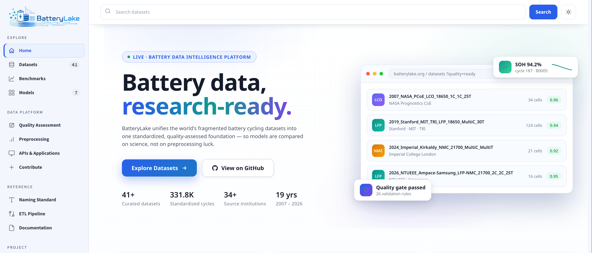
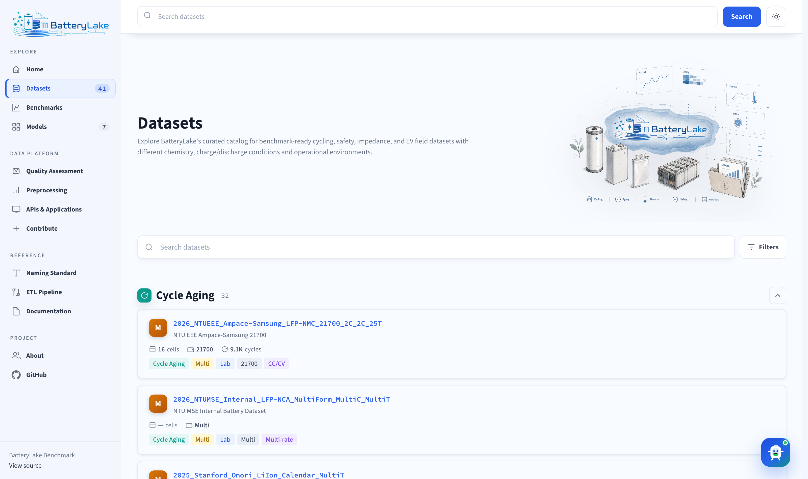
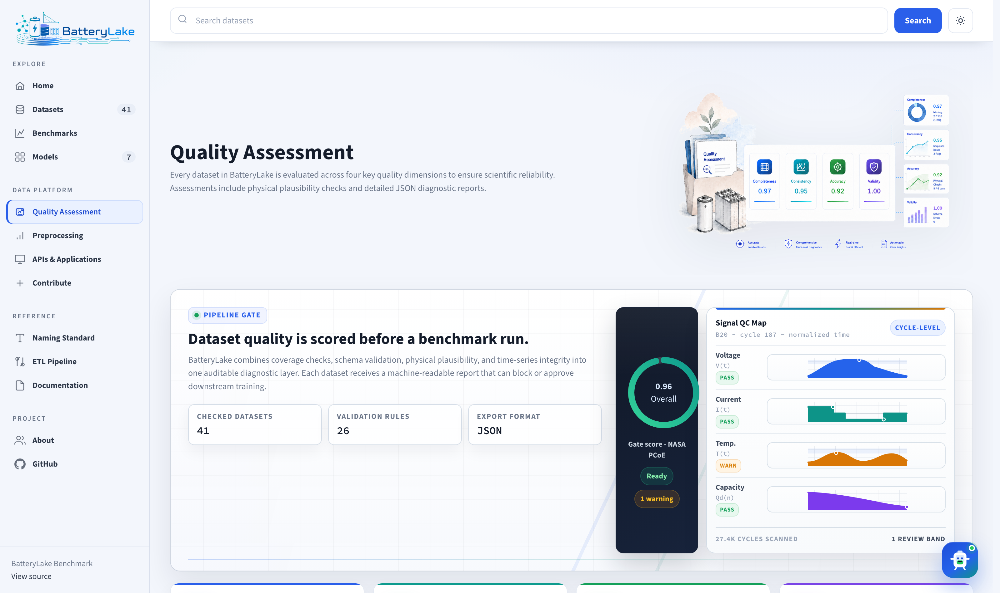
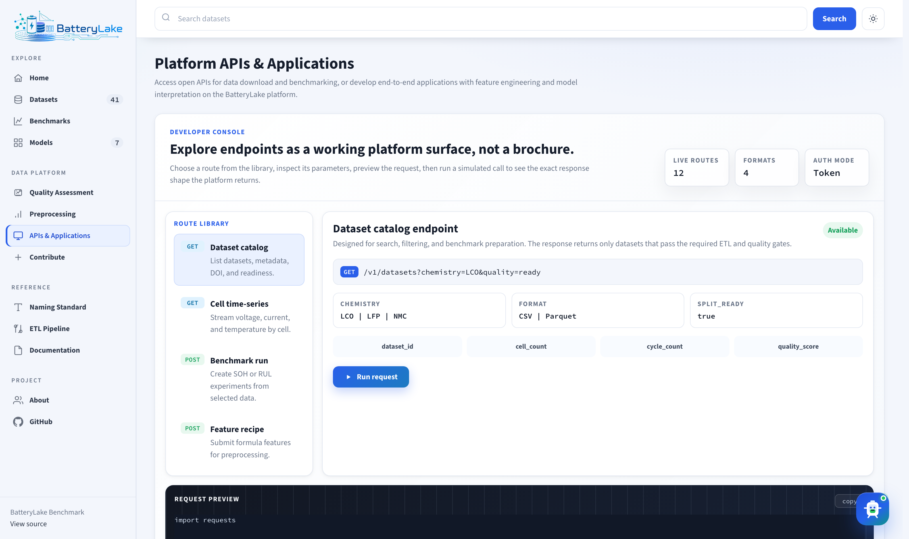

<div align="center">

# 🔋 BatteryLake

### The Open Data Foundation for Battery Prognostics & Health Management

**One naming standard. One ETL pipeline. One quality gate. Battery data, research-ready.**

[](#-whats-inside)
[](#-whats-inside)
[](#-whats-inside)
[](#-whats-inside)
[](#-whats-inside)

[Explore the Platform](https://tianwen1209.github.io/batterylake/) · [Who It Serves](#-who-batterylake-serves) · [Platform Tour](#-platform-tour) · [How to Use](#-how-to-use) · [Data Schema](#-standardized-data-schema) · [Benchmarks](#-benchmark-tasks) · [Contributing](#-contributing)

<br/>



</div>

---

## 💡 Why BatteryLake?

Battery degradation research is held back by a **data fragmentation crisis**. Every lab releases cycling data in its own format — its own column names, units, sampling rates, and file conventions — scattered across Zenodo, Figshare, Mendeley, OSF, institutional servers, and paper supplements. Before anyone trains a single model, weeks disappear into downloading, decoding, cleaning, and reconciling incompatible files. Worse: because everyone preprocesses differently, **published accuracy numbers are rarely comparable across papers**.

**BatteryLake removes that barrier.** We curate, standardize, and quality-check battery cycling datasets from laboratories worldwide into a single uniform schema, then expose them through an interactive catalog, a reproducible benchmark suite, and open APIs — so models for **State-of-Health (SOH) estimation** and **Remaining-Useful-Life (RUL) prediction** are finally compared on science, not on preprocessing luck.

> Fair, reproducible comparison across **34+ institutions and 19 years** of battery aging research.

---

## 🎯 Who BatteryLake Serves

BatteryLake is built as **community infrastructure** for three overlapping research communities:

| | You are… | BatteryLake gives you… |
|---|---|---|
| 🔬 | **A battery researcher** studying degradation, chemistry, or cell design | A curated catalog of 41+ aging datasets across LFP / NMC / LCO / NCA chemistries and 7 form factors — searchable by chemistry, C-rate, temperature, and institution, with DOI-level provenance for every source. Publish your own data through the contribution pipeline and make it instantly reusable. |
| 🤖 | **An ML researcher** building SOH / RUL / degradation models | Standardized benchmark tasks with pinned train/val/test splits, a reference model suite (Ridge → Random Forest → XGBoost → MLP → LSTM → Transformer → PINN), and unified RMSE / MAE / MAPE reporting — so your new architecture gets an honest, like-for-like comparison. |
| 📊 | **A data scientist / engineer** who needs clean time-series at scale | One schema for everything: `metadata.json` + `timeseries.parquet` + `cycle_summary.csv` per dataset, loadable in two lines of pandas. Machine-readable quality reports, a machine-readable naming standard, and REST APIs for programmatic access. |

If your work touches battery data from more than one source, BatteryLake is designed to save you weeks.

---

## 📸 Platform Tour

### 🗂️ Dataset Catalog — browse, filter, download

Search 41+ curated datasets by chemistry, form factor, category, domain, and duty profile. Every dataset card carries ETL status, cell/cycle counts, and links to both **source** and **processed** data.



### 🛡️ Quality Assessment — an auditable gate before training

Every dataset is scored across four dimensions — **completeness, consistency, accuracy, validity** — backed by 26 physical-plausibility and schema rules (voltage windows, coulombic-efficiency bounds, capacity monotonicity, timestamp integrity…). Each dataset ships a machine-readable `quality_report.json` that approves or blocks downstream training.



### ⚡ Developer Console — the same platform, programmable

Explore REST endpoints interactively: query the dataset catalog, stream per-cell time-series, launch benchmark runs, and submit feature recipes. Responses embed provenance and quality scores by default.



---

## 📦 What's Inside

| Metric | Value | Notes |
|---|---:|---|
| **Curated datasets** | 41+ | Public archives + internal NTU experiments |
| **Individual cells** | 1,499+ | Across all chemistries and form factors |
| **Charge/discharge cycles** | 331.8K | Standardized, per-cycle aligned |
| **Data volume** | 9.7 GB | Uniform Parquet/CSV time-series + summaries |
| **Source institutions** | 34+ | Laboratories worldwide |
| **Publication span** | 2007 – 2026 | 19 years of battery aging research |

**Chemistries:** `LFP` · `NMC` · `NMC811` · `LCO` · `NCA` · multi-chemistry
**Form factors:** `18650` · `21700` · `Pouch` · `Prismatic` · `Cylindrical` · `Automotive` · `EV-BMS`
**Sources include:** NASA PCoE · CALCE (UMD) · Stanford–MIT–TRI · Oxford (Howey) · RWTH Aachen · Sandia (SNL) · HNEI · XJTU · KIT · Tsinghua · CMU · Stanford (Onori) · TUM · Beihang · Imperial College · Iowa State (ILCC) · EVERLASTING (4TU) · NTU EEE — and more.

---

## 🏷️ Naming Standard

Every dataset receives a machine-readable reference name encoding its key experimental parameters — so a filename alone tells you what you are loading:

```
YYYY _ SOURCE _ CHEMISTRY _ FORMFACTOR _ CHRGC _ DCHRGC _ TEMPT
```

| Field | Meaning |
|---|---|
| `YYYY` | Publication / collection year |
| `SOURCE` | Lab or institution (e.g. `NASA_PCoE`, `Imperial_Kirkaldy`) |
| `CHEMISTRY` | `LFP` / `NMC` / `LCO` / `NCA` / `MultiChem` |
| `FORMFACTOR` | `18650` / `21700` / `Pouch` / `Prismatic` … |
| `CHRGC` / `DCHRGC` | Charge / discharge C-rates (or `MultiC`) |
| `TEMPT` | Ambient test temperature in °C (or `MultiT`) |

```text
2007_NASA_PCoE_LCO_18650_1C_1C_25T
2019_Stanford_MIT_TRI_LFP_18650_MultiC_30T
2024_Imperial_Kirkaldy_NMC_21700_MultiC_MultiT
2026_NTUEEE_Ampace-Samsung_LFP-NMC_21700_2C_2C_25T
```

---

## 🧱 Standardized Data Schema

Heterogeneous raw exports are converted through one reproducible ETL pipeline:

```
Raw Data → Download & Validate → ETL Processing → Quality Gate → Split Protocol → Training → Evaluation
```

Each processed dataset is published as four artifacts:

| File | Contents |
|---|---|
| `metadata.json` | Cell-level metadata: chemistry, form factor, nominal capacity, source lab, test conditions, publication DOI |
| `timeseries.parquet` | Per-cycle, per-cell measurements: `voltage_V`, `current_A`, `temperature_C`, `capacity_Ah`, `timestamp` |
| `cycle_summary.csv` | Cycle-level aggregates: discharge/charge capacity, coulombic efficiency, internal resistance, cycle number |
| `dataset_note.md` | Human-readable provenance, known issues, preprocessing decisions, usage recommendations |

Loading any dataset is the same two lines, regardless of which lab it came from:

```python
import pandas as pd

ts     = pd.read_parquet("2007_NASA_PCoE_LCO_18650_1C_1C_25T/timeseries.parquet")
cycles = pd.read_csv("2007_NASA_PCoE_LCO_18650_1C_1C_25T/cycle_summary.csv")

soh = cycles["discharge_capacity_Ah"] / cycles["discharge_capacity_Ah"].iloc[0]
```

---

## 📊 Benchmark Tasks

BatteryLake defines standardized prognostics tasks with fixed, reproducible split protocols:

- **🔋 SOH Estimation** — predict state-of-health (capacity fade) from cycling signals
- **⏳ RUL Prediction** — predict remaining useful life (cycles to end-of-life)

**Split protocols:** random · temporal · cross-cell — always with pinned seeds.
**Reference model suite:** classical baselines (**Ridge**, **Random Forest**, **XGBoost**) → deep sequence models (**MLP**, **LSTM**, **Transformer**) → **physics-informed neural networks (PINN)**.
**Metrics:** RMSE · MAE · MAPE, reported on identical folds.

Every benchmark run exports a portable training package, so results can be reproduced outside the platform.

---

## 🚀 Getting Started

```bash
# Clone the repository
git clone https://github.com/tianwen1209/batterylake.git
cd batterylake

# Serve the interactive catalog locally
python3 -m http.server 8000
# then open http://localhost:8000
```

Or visit the hosted platform directly to browse datasets, inspect quality reports, configure benchmark experiments, and download both **source** and **processed** data.

---

## 🧭 How to Use

A typical workflow, end to end:

### 1 · Find your data

Open **Datasets**, then search or filter by chemistry, form factor, category, domain, or duty profile. Click any dataset card to inspect its metadata, Processed Data Files Check, and notes — the detail view links to both the **original source** (DOI) and the **processed download**.

### 2 · Load it in Python

Every processed dataset follows the same schema (see [Standardized Data Schema](#-standardized-data-schema)):

```python
import pandas as pd

ts     = pd.read_parquet("<ref_name>/timeseries.parquet")   # V / I / T per cycle per cell
cycles = pd.read_csv("<ref_name>/cycle_summary.csv")        # one row per cycle
```

### 3 · Run a benchmark

On the **Benchmarks** page: **select a dataset → choose features → set the train/val/test split → pick a model**, then download the generated training package and run it locally:

```bash
unzip bt_benchmark_soh_lstm.zip
cd bt_benchmark_soh_lstm
mkdir -p data
# copy the processed dataset folder into data/ first, e.g.:
# cp -R /path/to/2019_Stanford_MIT_TRI_LFP_18650_MultiC_30T data/

python3 -m venv .venv
source .venv/bin/activate
pip install -r requirements.txt
bash run_benchmark.sh
```

When the run finishes, upload the `outputs/` folder back on the same page to view metrics, per-cell prediction trajectories, and model comparisons.

### 4 · Check quality before you train

Every dataset's **Quality Assessment** report (completeness / consistency / accuracy / validity + physical-plausibility checks) is available on the platform and as machine-readable JSON — use it to decide whether a dataset enters your training set.

### 5 · Go programmatic

Use the **APIs & Applications** console to query the catalog, stream cell time-series, and launch benchmark runs from code.

---

## 🤝 Contributing

BatteryLake grows with the community. Ways to contribute:

- **📤 Contribute a dataset** — use the *Contribute* page on the platform; all submissions pass through the same ETL and quality-assessment pipeline, and retain full attribution + DOI linkage to your original publication.
- **🧪 Add a model or task** — reference implementations live in the benchmark suite; new baselines and prognostics tasks are welcome.
- **🐛 Report issues** — schema problems, quality-rule false positives, or catalog corrections via [GitHub Issues](https://github.com/tianwen1209/batterylake/issues).

Every dataset keeps attribution to its original source. **Please cite the underlying datasets when you use them.**

---

## 👥 Team

Developed at **Nanyang Technological University, Singapore**.

| Group | Members |
|---|---|
| **Project Supervisors** | Prof. Yonggang Wen *(Principal Investigator)* · Dr Wang Hao *(Research Fellow)* |
| **Core Researcher** | Zhu Tianwen *(PhD Candidate)* |
| **Web Engineering** | Liu Kefan · Cao Han · Cai Yezi *(Frontend Engineers)* |

---

## 📌 Citation

If BatteryLake supports your research, please cite:

```bibtex
@misc{zhu2026batterylakeagenticphysicsgroundedcuration,
      title={BatteryLake: Agentic, Physics-Grounded Curation of Heterogeneous Battery Aging Data and Benchmarking}, 
      author={Tianwen Zhu and Hao Wang and Yonggang Wen},
      year={2026},
      eprint={2607.09762},
      archivePrefix={arXiv},
      primaryClass={cs.AI},
      url={https://arxiv.org/abs/2607.09762}, 
}
```

---

## 🙏 Acknowledgements

BatteryLake stands on the shoulders of the open battery-data community. We gratefully acknowledge every laboratory and repository whose published datasets make this platform possible — NASA PCoE, CALCE, the Stanford–MIT–TRI consortium, Oxford, RWTH Aachen, Sandia, HNEI, and many more. Each dataset retains attribution to its original source and DOI.

<div align="center">

---

**BatteryLake** — turning scattered battery data into a shared scientific foundation.

</div>
